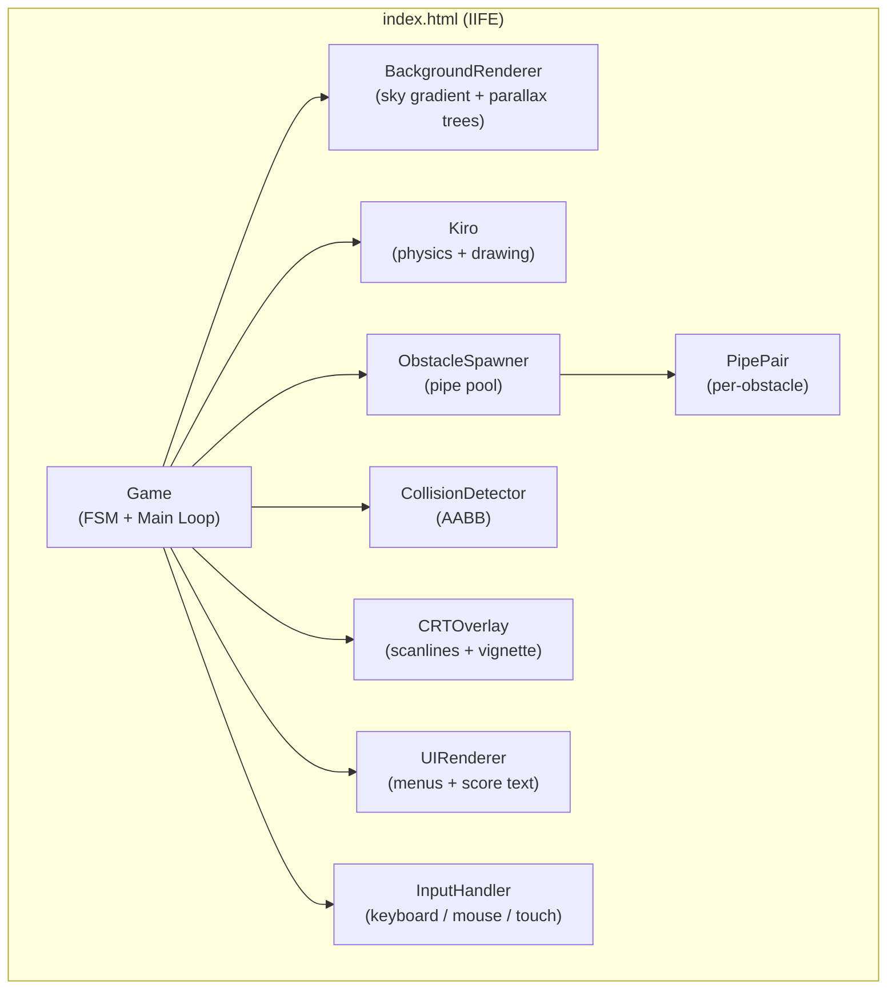
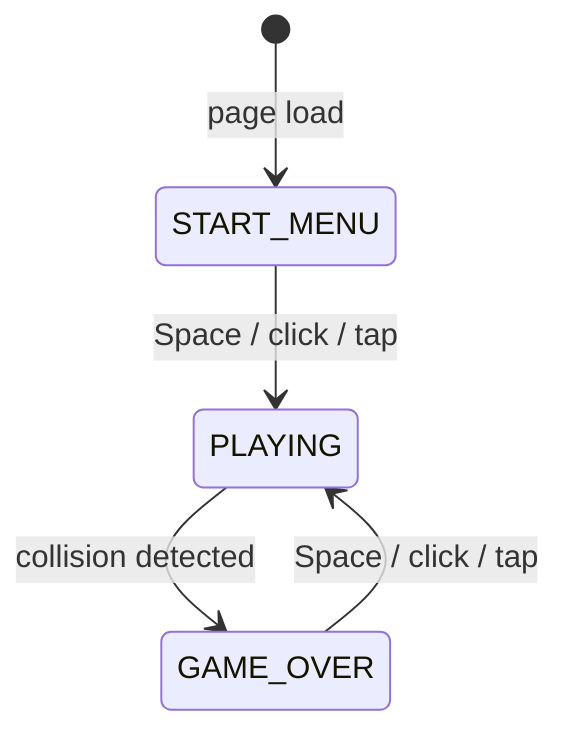

# Design Document — Flappy Kiro

## Overview

Flappy Kiro is a single-file, browser-playable endless side-scrolling arcade game delivered as one self-contained `index.html`. The player controls Kiro — a white pixel ghost — by tapping, clicking, or pressing Space to "flap" upward through an infinite stream of green pipe obstacles.

The entire game is implemented in vanilla HTML5 Canvas and JavaScript, with no external dependencies. All visual assets are drawn procedurally via the Canvas 2D API. The architecture follows a classic game-loop pattern with modular object-oriented components organized inside an IIFE to avoid polluting the global scope.

Key design goals:
- **Frame-independent physics** via delta-time so the game behaves identically at 30 fps, 60 fps, or 120 fps.
- **Single-file delivery** — all HTML, CSS, and JavaScript are inline with zero external resource references.
- **Retro aesthetic** — 16-bit twilight sky, parallax pine-forest, pixel-art ghost, CRT scanline overlay, and arcade-cabinet CSS wrapper.
- **Persistent high score** via `localStorage` with graceful fallback on write failure.

---

## Architecture

The game follows a **Modular Object-Oriented** architecture with a central `Game` class acting as the FSM controller and main-loop orchestrator. All subsystems are instantiated once at boot and communicated with directly.



### FSM State Transitions



The game loop always runs (`requestAnimationFrame`). The FSM state gates which subsystems are active each frame:

| State | Physics | Spawner | Renderer | Input Action |
|---|---|---|---|---|
| `START_MENU` | idle | idle | background + Kiro (idle) + UI | → PLAYING |
| `PLAYING` | active | active | background + pipes + Kiro + score | flap Kiro |
| `GAME_OVER` | idle | idle | background + pipes (frozen) + Kiro + score + UI | → PLAYING (reset) |

### Rendering Order (every frame)

Each frame draws layers strictly in order to achieve correct visual stacking:

1. **Background** — sky gradient + star dots + parallax pine silhouette
2. **Pipes** — all active `PipePair` instances
3. **Kiro** — player ghost
4. **Score / UI text** — HUD or menu overlay
5. **CRT Overlay** — scanlines + vignette (always last)

---

## Components and Interfaces

### `Game` (top-level controller)

Owns the FSM state, score, high score, and the `requestAnimationFrame` loop. Delegates all work to subsystems.

```js
class Game {
  state: 'START_MENU' | 'PLAYING' | 'GAME_OVER'
  score: number
  hiScore: number

  _loop(timestamp: DOMHighResTimeStamp): void  // main loop
  _onInput(): void                             // routes input to FSM or Kiro
  _startPlaying(): void                        // resets and enters PLAYING
  _triggerGameOver(): void                     // saves high score, enters GAME_OVER
  _checkScoring(): void                        // detects pipe-pass events
}
```

### `Kiro` (player character)

Encapsulates position, velocity, tail-animation time, physics update, flap impulse, hitbox computation, and rendering.

```js
class Kiro {
  x: number        // horizontal center (fixed at 120px)
  y: number        // vertical center (canvas-relative)
  w: number        // sprite width  = 40px
  h: number        // sprite height = 48px
  vy: number       // vertical velocity (px/s), positive = downward
  time: number     // elapsed seconds since PLAYING start (for tail animation)

  reset(): void
  flap(): void           // sets vy = FLAP_VEL (−420 px/s)
  update(dt): void       // applies gravity, clamps terminal velocity, integrates position
  getBounds(): AABB      // returns inset bounding box (6px shrink on all sides)
  draw(): void
}
```

### `PipePair` (single obstacle)

Represents one top+bottom pipe pair. Carries its x-position, gap center Y, and whether it has been scored.

```js
class PipePair {
  x: number
  gapCenterY: number
  scored: boolean        // true once Kiro's center has passed pipe.x + PIPE_WIDTH

  topPipeH: number       // computed: gapCenterY − PIPE_GAP/2
  botPipeY: number       // computed: gapCenterY + PIPE_GAP/2
  botPipeH: number       // computed: CANVAS_H − botPipeY

  getTopBounds(): AABB
  getBotBounds(): AABB
  update(dt): void       // moves x left by PIPE_SPEED * dt
  draw(): void
}
```

### `ObstacleSpawner`

Manages the active pipe pool. Spawns a new pair when the rightmost pipe's left edge crosses `canvas_width − 220`. Culls pipes whose right edge (`x + PIPE_WIDTH`) is `< 0`.

```js
class ObstacleSpawner {
  pipes: PipePair[]

  reset(): void
  update(dt): void    // scrolls pipes, triggers spawn/cull
  draw(): void
}
```

### `CollisionDetector`

Stateless AABB helper. `check()` returns `true` if Kiro intersects any pipe segment, the floor, or the ceiling.

```js
class CollisionDetector {
  _overlaps(a: AABB, b: AABB): boolean
  check(kiro: Kiro, pipes: PipePair[]): boolean
}
```

### `InputHandler`

Registers `keydown`, `mousedown`, and `touchstart` listeners exactly once at construction. Fires a single callback (`onAction`) for any qualifying event. The callback is dispatched to `Game._onInput()`, which routes it based on the current FSM state.

```js
class InputHandler {
  constructor(onAction: () => void)
  // listeners attached once — never removed or re-registered
}
```

### `BackgroundRenderer`

Draws the sky gradient and star dots each frame. Maintains a scroll offset (`treeOff`) that advances only in `PLAYING` state. The pine silhouette is pre-rendered to an offscreen canvas of width `CANVAS_W × 2` (960 px) once at construction, then tiled across the canvas each frame using two `drawImage` calls for seamless looping.

```js
class BackgroundRenderer {
  treeCanvas: OffscreenCanvas  // 960 × 160 pre-rendered silhouette
  treeOff: number              // current scroll offset (0 → CANVAS_W, then wraps)

  update(dt, state): void
  draw(): void
}
```

### `CRTOverlay`

Pre-bakes a 1 × `CANVAS_H` scanline strip (1 px black stripe every 2 rows at 10% opacity) into an offscreen canvas at construction. Each frame tiles this strip with `createPattern` and then draws a radial gradient vignette.

```js
class CRTOverlay {
  _scanlines: HTMLCanvasElement   // 1 × 640 pre-baked strip
  draw(): void
}
```

### `UIRenderer`

Stateless drawing helpers. Provides `_shadow()` which renders text twice — once offset by (+2, +2) in `rgba(0,0,0,0.75)` (shadow), then again at the nominal position in the primary color.

```js
class UIRenderer {
  _shadow(x, y, text, size, color): void
  drawScore(score): void
  drawStartMenu(highScore): void
  drawGameOver(score, highScore): void
}
```

---

## Data Models

### Constants

| Name | Value | Description |
|---|---|---|
| `CANVAS_W` | 480 px | Logical canvas width |
| `CANVAS_H` | 640 px | Logical canvas height |
| `GRAVITY` | 1200 px/s² | Downward acceleration |
| `FLAP_VEL` | −420 px/s | Upward impulse on flap |
| `TERMINAL_VEL` | 600 px/s | Maximum downward speed |
| `PIPE_SPEED` | 200 px/s | Horizontal scroll speed of pipes |
| `PIPE_GAP` | 160 px | Vertical opening between top and bottom pipe |
| `PIPE_WIDTH` | 60 px | Horizontal width of each pipe segment |
| `PIPE_SPACING` | 220 px | Min distance between consecutive pipe left-edges |
| `PIPE_MIN_Y` | 160 px | Minimum gap-center y from ceiling |
| `PIPE_MAX_Y` | `CANVAS_H − 160` | Maximum gap-center y from floor |
| `TREE_SPEED` | 60 px/s | Parallax scroll speed for pine silhouette |
| `HIT_INSET` | 6 px | Hitbox shrink on all four sides |
| `DT_CAP` | 0.1 s | Maximum allowed delta-time per frame |
| `LS_KEY` | `"flappyKiroHighScore"` | localStorage key for high score |

### AABB (Axis-Aligned Bounding Box)

```js
{ x: number, y: number, w: number, h: number }
// x, y = top-left corner; w, h = dimensions
```

Kiro's inset bounding box:
- Top-left: `(kiro.x − kiro.w/2 + HIT_INSET, kiro.y − kiro.h/2 + HIT_INSET)`
- Effective size: `(kiro.w − 2×HIT_INSET) × (kiro.h − 2×HIT_INSET)` = 28 × 36 px

> Note: Requirements §6.1 specify a 32×32 sprite shrunk by 6 px on all sides yielding a 20×20 effective box. The implementation uses a 40×48 sprite (§8) with a 6 px HIT_INSET, producing a 28×36 box, which is the "hitbox_inset" interpretation applied to the actual sprite dimensions.

### Pipe Gap Geometry

```
y=0                   ┌──────────┐
                       │  TOP     │  height = gapCenterY − PIPE_GAP/2
                       │  PIPE    │
gapCenterY−80          └────╗╔────┘  ← cap flange (pipe_width + 16, 20 px tall)
                             ║║
                       GAP   ║║  160 px
                             ║║
gapCenterY+80          ┌────╝╚────┐  ← cap flange
                       │  BOTTOM  │  height = CANVAS_H − (gapCenterY + PIPE_GAP/2)
                       │  PIPE    │
y=CANVAS_H             └──────────┘
```

### FSM State Enum

```js
const STATE = {
  START:   'START_MENU',
  PLAYING: 'PLAYING',
  OVER:    'GAME_OVER'
};
```

### Kiro Tilt Angles

| Condition | Direction | Max angle |
|---|---|---|
| `vy < 0` (moving up) | Counter-clockwise | 20° (`≈ 0.349 rad`) |
| `vy > 0` (moving down) | Clockwise | 30° (`≈ 0.524 rad`) |

Interpolation: `angle = direction × min(|vy| / TERMINAL_VEL, 1) × maxAngle`

### Tail Animation Phase Offsets

| Curve | Phase offset (radians) |
|---|---|
| Left bump | 2.4 |
| Center bump | 1.2 |
| Right bump | 0.0 |

Animation formula: `y_offset = 8 × sin(elapsed_time × 6 + phase_offset)`

---

## Correctness Properties

*A property is a characteristic or behavior that should hold true across all valid executions of a system — essentially, a formal statement about what the system should do. Properties serve as the bridge between human-readable specifications and machine-verifiable correctness guarantees.*

### Property 1: Delta-time clamping

*For any* raw frame gap value (including values far exceeding normal frame timing, such as after a tab switch), the delta-time value delivered to the physics engine and obstacle spawner SHALL never exceed 0.1 seconds.

**Validates: Requirements 2.3**

---

### Property 2: Flap unconditionally overrides velocity

*For any* initial vertical velocity of Kiro — whether large positive (terminal fall), large negative (fast rise), or zero — invoking `flap()` SHALL set `vy` to exactly −420 px/s, with no dependence on the prior value.

**Validates: Requirements 3.3**

---

### Property 3: Terminal velocity is never exceeded

*For any* number of consecutive physics update frames with any valid delta-time values in (0, 0.1], Kiro's downward vertical velocity SHALL never exceed +600 px/s after each frame's clamp step.

**Validates: Requirements 3.4**

---

### Property 4: Pipe gap is always exactly 160 pixels

*For any* spawned `PipePair` with any gap center y-coordinate in the valid range, the vertical opening between the bottom edge of the top pipe (`gapCenterY − 80`) and the top edge of the bottom pipe (`gapCenterY + 80`) SHALL always equal exactly 160 pixels.

**Validates: Requirements 5.6**

---

### Property 5: Pipe gap center always stays in bounds

*For any* newly spawned `PipePair`, the gap center y-coordinate SHALL lie within the closed interval [160, `CANVAS_H` − 160], ensuring neither pipe segment is fully hidden or the gap clipped by the canvas boundary.

**Validates: Requirements 5.3, 5.5**

---

### Property 6: Each pipe pair is scored exactly once

*For any* `PipePair` and any sequence of Kiro x-positions, the score SHALL increment by exactly 1 when Kiro's center crosses the pipe's right edge for the first time, and subsequent crossings of the same pipe pair SHALL produce no further score increment (enforced by the `scored` boolean flag).

**Validates: Requirements 7.2**

---

### Property 7: High-score localStorage round-trip

*For any* non-negative integer score value that is greater than the current high score, writing it to `localStorage` via `triggerGameOver()` and subsequently reading and parsing that key SHALL produce the same non-negative integer; and for any string stored under the key — including null, non-numeric strings, negative numbers, or floating-point strings — the initialization logic SHALL either parse it as a valid non-negative integer or default to 0.

**Validates: Requirements 7.4, 7.5**

---

### Property 8: AABB intersection test is commutative

*For any* two axis-aligned bounding boxes A and B (with any position and dimensions), `_overlaps(A, B)` SHALL return the same boolean result as `_overlaps(B, A)`.

**Validates: Requirements 6.2**

---

### Property 9: Tail animation offsets are always bounded

*For any* elapsed time value `t ≥ 0` and each of the three phase offsets (0, 1.2, 2.4 radians), the tail animation y-offset computed as `8 × sin(t × 6 + phase)` SHALL always lie within the closed interval [−8, +8] pixels.

**Validates: Requirements 8.5**

---

## Error Handling

### localStorage Failures

`localStorage.setItem` can throw `DOMException` (quota exceeded, private-browsing restrictions). The game wraps the write in a `try/catch` that silently swallows the error and retains the in-memory `hiScore` value. The game functions normally without persistence.

`localStorage.getItem` returns `null` when the key is absent, or a string that may not represent a valid integer. The initialization code parses the value with `parseInt(..., 10)` and defaults to `0` for any non-finite, negative, or null result.

### Frame Timing Edge Cases

- **First frame**: `_lastTime` is `null`, so `dt` is forced to `0` and no physics update occurs.
- **Tab switch / backgrounding**: the timestamp gap can be several seconds. The `DT_CAP` of 0.1 s prevents a sudden position jump that would make the game unwinnable on return.
- **Clock anomaly (dt ≤ 0)**: treated as `dt = 0`; no physics update is performed.

### Collision Detection during State Transitions

Per Requirement 2.4, if the `CollisionDetector` signals `GAME_OVER` mid-frame, the `Renderer` completes its current frame draw before the FSM honors the transition. This ensures the player sees the final frame with Kiro at its collision position rather than a blank or partially drawn frame.

### Canvas Context Unavailability

If `canvas.getContext('2d')` returns `null` (e.g., browser has Canvas disabled), the game will throw at the first draw call. No explicit guard is required given Canvas 2D is universally supported in modern browsers; the single-file delivery target does not include legacy browser support.

---

## Testing Strategy

### Applicability of Property-Based Testing

This feature is well-suited for property-based testing on the **pure logic layer** — physics calculations, AABB collision geometry, pipe gap geometry, scoring logic, and delta-time clamping. These are pure functions with clear input/output behavior and large input spaces where random sampling reveals edge cases.

The **rendering layer** (Canvas 2D drawing, CRT overlay, background parallax) is not suitable for PBT. Visual correctness is better validated through snapshot tests or manual inspection. The same applies to the HTML/CSS shell (Requirement 13).

### Recommended Testing Libraries

| Layer | Library |
|---|---|
| Property-based tests | [fast-check](https://github.com/dubzzz/fast-check) (JavaScript) |
| Unit/example tests | [Vitest](https://vitest.dev/) or Jest |

### Unit Tests (example-based)

Focus on specific scenarios and integration points:

- FSM transitions: START → PLAYING resets score, position, velocity, pipe list; PLAYING → GAME_OVER preserves state; GAME_OVER → PLAYING resets all.
- Input routing: Space/click/touch in PLAYING fires `flap()`, in START/OVER fires state advance.
- `localStorage` initialization: null key → score 0; invalid string → score 0; valid "42" → score 42.
- `localStorage` write failure: silently caught, in-memory high score preserved.
- Scoring flag: `scored` set to `true` on first pass, subsequent frames do not increment.
- Rendering order: background drawn first, CRT overlay drawn last.

### Property-Based Tests (minimum 100 iterations each)

Each property test corresponds to a Correctness Property in this document.

| Tag | Property | Generator |
|---|---|---|
| **Feature: flappy-kiro, Property 1: delta-time clamping** | `min(rawDt, 0.1) === clampedDt` | Arbitrary positive floats including values > 0.1 |
| **Feature: flappy-kiro, Property 2: flap overrides velocity** | `kiro.flap(); assert(kiro.vy === −420)` | Arbitrary initial `vy` values |
| **Feature: flappy-kiro, Property 3: terminal velocity clamping** | After N gravity updates, `kiro.vy ≤ 600` | Arbitrary N, arbitrary dt in (0, 0.1] |
| **Feature: flappy-kiro, Property 4: pipe gap invariant** | `pipe.botPipeY − pipe.topPipeH === 160` | Arbitrary gap center in [160, 480] |
| **Feature: flappy-kiro, Property 5: pipe gap center bounds** | `gapY ∈ [160, CANVAS_H − 160]` | Seeded random for spawner |
| **Feature: flappy-kiro, Property 6: score monotonicity** | Score only increases; each pipe scored at most once | Arbitrary pipe sequences and Kiro x-positions |
| **Feature: flappy-kiro, Property 7: high-score persistence round-trip** | `parseInt(String(n), 10) === n` for any non-negative integer | Arbitrary non-negative integers |
| **Feature: flappy-kiro, Property 8: AABB intersection symmetry** | `overlaps(A, B) === overlaps(B, A)` | Arbitrary pairs of AABBs |
| **Feature: flappy-kiro, Property 9: tail animation continuity** | `|8 × sin(t × 6 + phase)| ≤ 8` for all t, phase | Arbitrary `t ≥ 0`, phases in {0, 1.2, 2.4} |

### Integration / Smoke Tests

- Game initializes without throwing when `window.load` fires in a headless browser (Playwright/jsdom).
- Canvas element has correct `width="480"` and `height="640"` attributes.
- `localStorage` key `"flappyKiroHighScore"` is written after a simulated scoring run.
- No external network requests are made during a full play session (CSP audit).
